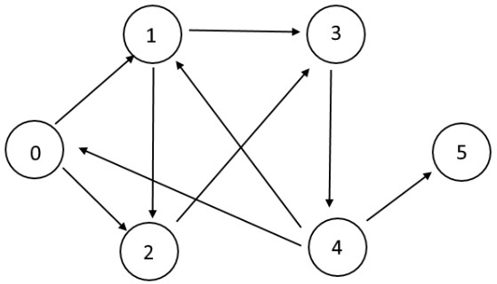

# 너비 우선 탐색 (BFS)

BFS는 트리 또는 그래프 자료구조를 순회(Traversal)하기 위한 알고리즘이다. 한 노드에서 시작해서 그 노드의 모든 인접 노드들을 탐색한 뒤 다음 깊이로 이동한다.

# BFS in Tree


- level order traversal : `1 2 3 4 5`
- 시간 복잡도 $O(V)$
- 공간 복잡도 $O(V)$

```py
def bfs(root):
    q = [root]
    while q:
        node = q.pop(0)
        print(node.val, end=' ')
        if node.left:
            q.append(node.left)
        if node.right:
            q.append(node.right)
```

# BFS in Graph



- 시간 복잡도 $O(V+E)$

```py
from queue import Queue


def bfs(start, v, g):
    visited = [False] * v
    visited[start] = True
    q = Queue()
    q.put(start)
    while not q.empty():
        n = q.get()
        print(n, end=' ')
        for node in g.get(n, []):
            if not visited[node]:
                q.put(node)
                visited[node] = True
    print()


if __name__ == '__main__':
    vertices = 6
    graph = {
        0: [1, 2],
        1: [2, 3],
        2: [3],
        3: [4],
        4: [0, 1, 5],
    }
    bfs(0, vertices, graph)  # 0 1 2 3 4 5
```
