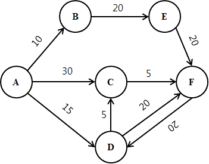

# 다익스트라 알고리즘 (Dijkstra Algorithm)

- 음의 가중치가 없는 그래프에서 한 노드에서 다른 모든 노드까지의 최단거리를 찾는 알고리즘
- 시간 복잡도 $O((V+E)\log V)$

## 다익스트라 알고리즘 로직



- 노드 A부터 F까지의 최단거리계산
- S = 방문한 노드들의 집합
- Q = 방문하지 않은 노드들의 집합
- d[N] = `A -> N`까지 계산된 최단거리

<br />

**데이터 초기화**

```
S = { }
Q = { A, B, C, D, E, F }
d = [ A=0, B=INF, C=INF, D=INF, E=INF, F=INF ]
```

<br />

**이웃 노드 방문**

모든 이웃 노드와의 거리를 측정하여 `(A부터 N의 이웃노드까지 최단거리) = (A부터 N까지 최단거리) + (N과 이웃노드간 거리)`를 계산한다.

```
S = { A }
Q = { B, C, D, E, F }
d = [ A=0, B=10, C=30, D=15, E=INF, F=INF ]
```

<br />

**첫 루프 이후 최단거리 업데이트**

이후 방문할 노드는 Q에 남아있는 노드 중 `d[N]이 가장 작은 것(=B)`으로 선택하고, Q에서 제거하고 S에 추가한 후 `이웃 노드(=E)`를 탐색하여 `d[E](= 10 + 20)`을 변경한다.  
만일 기존의 `d[N]`보다 새로 계산한 `d[N]`이 짧다면 새로운 값으로 변경하고, 그렇지 않으면 변경하지 않는다.

```
S = { A, B }
Q = { C, D, E, F }
d = [ A=0, B=10, C=30, D=15, E=30, F=INF ]
```

<br />

Q가 공집합이 되면 루프를 종료하고 최단거리를 결정한다.  
목적지가 F였으므로 최단거리는 25이다.

```
S = { A, B, C, D, E, F }
Q = { }
d = [ A=0, B=10, C=20, D=15, E=30, F=25 ]
```

```py
import heapq
from collections import defaultdict


def dijkstra(edges, src, dist):
    adj = defaultdict(list)  # 인접관계
    for s, d, w in edges:
        adj[s].append((w, d))

    S = set()  # 방문한 노드들의 집합
    d = dict()  # src 에서 각 노드까지의 최단거리
    d[src] = 0

    heap = []
    heapq.heappush(heap, (0, src))

    while heap:
        weight, v = heapq.heappop(heap)
        if v not in S:
            S.add(v)
            if v == dist:
                break
            for w, neighbor in adj.get(v, ()):
                if neighbor in S:
                    continue
                prev = d.get(neighbor)
                new = weight + w
                if not prev or new < prev:
                    d[neighbor] = new
                    heapq.heappush(heap, (new, neighbor))

    return d[dist]


if __name__ == '__main__':
    src, dist = 'A', 'F'
    edges = [
        ('A', 'B', 10),
        ('A', 'C', 30),
        ('A', 'D', 15),
        ('D', 'C', 5),
        ('E', 'F', 20),
        ('C', 'F', 5),
        ('D', 'F', 20),
        ('F', 'D', 20),
    ]
    ans = dijkstra(edges, src, dist)
    print("%s -> %s 최단거리 %d" % (src, dist, ans))
```
