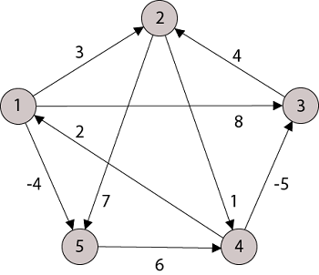

# 플로이드-워셜 알고리즘 (Floyd Warshall Algorithm)

- 간선의 가중치가 음이거나 양인 (음수 사이클은 없는) 가중 그래프에서 최단거리들을 찾는 알고리즘
- 가능한 모든 노드쌍들에 대한 최단거리를 구한다.
- 시간 복잡도 $O(V^3)$

## 플로이드-워셜 알고리즘 로직



임의의 노드 s부터 e까지 가는데 걸리는 최단거리를 저장하는 테이블 d

|     | 1        | 2        | 3        | 4        | 5        |
| --- | -------- | -------- | -------- | -------- | -------- |
| 1   | 0        | 3        | 8        | $\infty$ | -4       |
| 2   | $\infty$ | 0        | $\infty$ | 1        | 7        |
| 3   | $\infty$ | 4        | 0        | $\infty$ | $\infty$ |
| 4   | 2        | $\infty$ | -5       | 0        | $\infty$ |
| 5   | $\infty$ | $\infty$ | $\infty$ | 6        | 0        |

노드 s부터 e까지 가는데 걸리는 최단거리를 `d[s][e]`라고 하면, 이 `d[s][e]`를 구하기 위해서 s와 e사이의 모든 노드 m에 대해 현재 `d[s][e]`와 `d[s][m] + d[m][e]`를 비교해서 `d[s][m] + d[m][e]`가 더 작으면 `d[s][e]`를 업데이트한다.

```py
def floyd_warshall(v, d):
    for m in range(v):
        for s in range(v):
            for e in range(v):
                d[s][e] = min(d[s][m] + d[m][e], d[s][e])


if __name__ == '__main__':
    INF = float('inf')
    vertices = 5
    graph = [
        [0, 3, 8, INF, -4],
        [INF, 0, INF, 1, 7],
        [INF, 4, 0, INF, INF],
        [2, INF, -5, 0, INF],
        [INF, INF, INF, 6, 0]
    ]
    floyd_warshall(vertices, graph)

    for s in range(vertices):
        for e in range(vertices):
            print("노드 %d부터 %d까지 가는데 걸리는 최단거리 %d" % (s + 1, e + 1, graph[s][e]))
```
