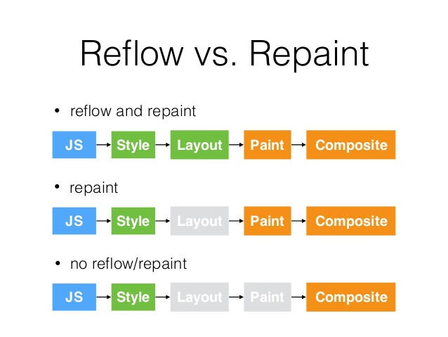
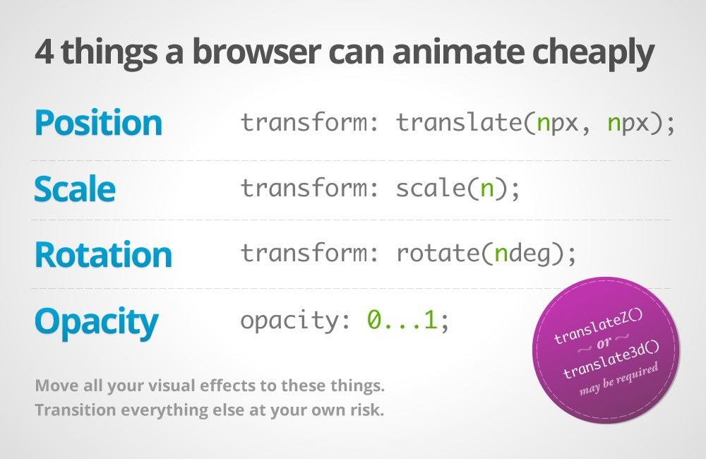

## 브라우저 아키텍처


브라우저 엔진 : 유저 인터페이스와 렌더링 엔진 사이의 중개자로, 유저 인터페이스에서 받은 입력에 따라 렌더링 엔진을 쿼리하고 처리한다.
렌더링 엔진 : HTML/CSS를 파싱해서 사용자가 요청한 특정 웹 페이지를 화면에 렌더링하는 역할을 한다.

## 렌더링 엔진이 하는 일


- 브라우저는 HTML 소스코드를 파싱하고 DOM tree를 만든다.
- 브라우저가 CSS 코드를 파싱한다.
- **render tree**를 생성한다. render tree는 styles를 알고 있기 때문에 `display: none` 이거나 `<head>` 처럼 보이지 않는 요소는 포함되지 않는다.
- render tree가 생성되면 브라우저는 render tree 노드들을 **paint** 할 수 있다.

## script, stylesheet

### 스크립트

- 스크립트가 실행되는 동안 문서의 파싱은 중단된다.
- `defer`로 표시하면 문서 파싱이 완료된 후 실행된다.
- `async`로 표시하면 비동기로 실행된다.

### 스타일시트

- 스타일시트는 DOM 트리를 변경하지 않기 때문에 문서 파싱을 중단하지 않는다.

## Repaint & Reflow & Composite



- **reflow (layout)** : render tree의 일부는 revalidated / recalculated 되어야 한다.
  - `position(위치)`이나 `geometries(기하학적 요소)` 재계산
  - reflow는 *user-blocking operation*이므로 최적화를 위해 이에 대한 이해가 필요하다.
- **repaint (redraw)** : 노드 위치 변경 또는 스타일 변경에 의해 화면에서 업데이트 되어야 한다.
  - `visibility` 변경, `outline` 변경, `background` 변경 등에 의해 발생한다.
  - paint는 픽셀 파이프라인에서 가장 비용이 많이 드는 부분이므로 레이어 승격 또는 애니메이션 orchestration을 통해 최적화 하는 것이 좋다.
- **composite** : 화면에 표시하기 위해 페이지에서 paint 된 부분을 합치는 과정이다.
  - `transform` 또는 `opacity` 변경에 의해 발생한다.
  - `will-change` 또는 `translateZ`를 사용해서 요소를 자체 레이어로 승격할 수 있다.
    - `will-change` 속성을 사용하면 해당 레이어는 GPU에 업로드된다.



```js
const bodyStyle = document.body.style; // cache

bodyStyle.padding = '20px'; // reflow, repaint
bodyStyle.border = '10px solid red'; // reflow, repaint

bodyStyle.color = 'blue'; // repaint only, no dimensions changed
bstyle.backgroundColor = '#cc0000'; // repaint

bodyStyle.fontSize = '2em'; // reflow, repaint

// new DOM element - reflow, repaint
document.body.appendChild(document.createTextNode('Hello!'));
```

https://csstriggers.com/ 에서 브라우저 엔진 별로 `layout` / `paint` / `composite`를 발생시키는 css properties를 확인할 수 있다. Webkit - Safari, Blink - Chrome, Gecko - Firefox, EdgeHTML - 구Edge다.

## 참고

- https://medium.com/swlh/what-the-heck-is-repaint-and-reflow-in-the-browser-b2d0fb980c08
- https://d2.naver.com/helloworld/59361 (https://www.html5rocks.com/en/tutorials/internals/howbrowserswork/)
- https://dev.to/gopal1996/understanding-reflow-and-repaint-in-the-browser-1jbg
- https://developers.google.com/web/fundamentals/performance/rendering/stick-to-compositor-only-properties-and-manage-layer-count
- https://www.sitepoint.com/10-ways-minimize-reflows-improve-performance/
