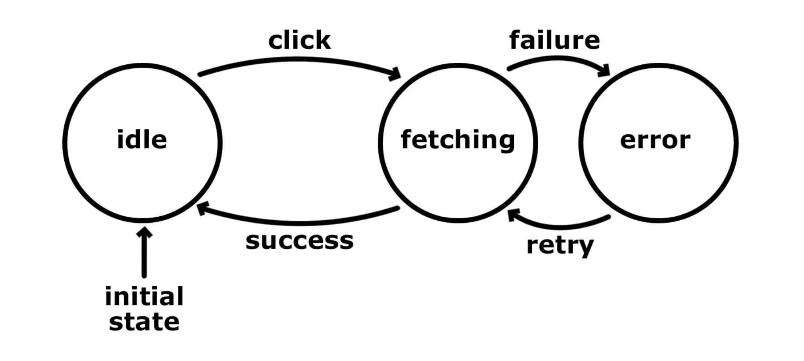
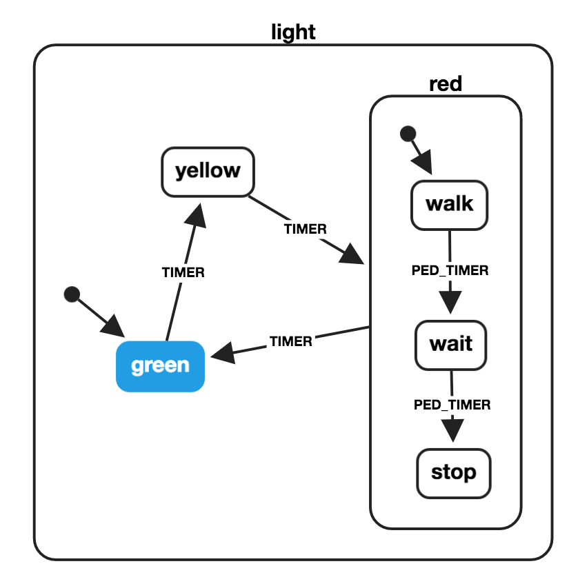

## FSM

`Finite State Machine(FSM)`은 유한한 개수의 상태를 가질 수 있는 automata이다. 이런 오토마타는 **한 번에 오로지 하나의 상태**만을 가지고, 어떠한 `event`에 의해 한 상태에서 다른 상태로 변경될 수 있으며 이를 `Transition`이라고 한다. 게임 로직에서 많이 사용되는 디자인 패턴이라고 한다.

가장 흔히 접할 수 있는 케이스가 data fetching 모델 인 것 같다. idle 상태(State)였다가 클릭 이벤트(Event)가 일어나면 fetching 상태로 변경(Transition)되고, 실패시 error 상태로 변경되며 성공시 다시 idle 상태로 변경된다. error 상태에서 재시도하면 fetching 상태로 변경된다. 여기서 상태는 3개이며, 한 시점에서는 하나의 상태만 가질 수 있다.
리액트 컴포넌트를 FSM으로 모델링하면 event는 사용자, 서버, 컴포넌트 props 등에 의해 제공되고 출력은 컴포넌트 렌더링이 될 것이다.

## xstate

`xstate`는 FSM을 구현할 수 있는 자바스크립트 / 타입스크립트 기반 라이브러리다. 대표적으로 `gatsby`에서 사용하고 있는 듯 하다.

```js
import { createMachine, interpret } from 'xstate';

// Stateless machine definition
const toggleMachine = createMachine({
  id: 'toggle',
  initial: 'inactive',
  states: {
    inactive: { on: { TOGGLE: 'active' } },
    active: { on: { TOGGLE: 'inactive' } },
  },
});
// machine.transition(...) 은 순수함수다
const nextState = toggleMachine.transition('active', 'TOGGLE');
console.log(nextState.value); / inactive

// Machine instance with internal state
const toggleService = interpret(toggleMachine)
  .onTransition((state) => console.log(state.value))
  .start(); // 'inactive'
toggleService.send('TOGGLE'); // 'active'
toggleService.send('TOGGLE'); // 'inactive'
```

### 계층 구조 state machine 구현



운전자 기준 신호등의 경우, 신호등이 빨간불(red)이 되면 횡단보도 신호가 walk로 변경되고, 일정 시간 후 카운트다운을 하는 wait로 변경되었다가 PED_TIMER 후 stop으로 전환된다. stop이 되면 TIMER 후 green으로 변경되는 구조다.

```js
import { createMachine } from 'xstate';

const pedestrianStates = {
  initial: 'walk',
  states: {
    walk: {
      on: {
        PED_TIMER: 'wait',
      },
    },
    wait: {
      on: {
        PED_TIMER: 'stop',
      },
    },
    stop: {},
  },
};
const lightMachine = createMachine({
  id: 'light',
  initial: 'green',
  states: {
    green: {
      on: {
        TIMER: 'yellow',
      },
    },
    yellow: {
      on: {
        TIMER: 'red',
      },
    },
    red: {
      on: {
        TIMER: 'green',
      },
      ...pedestrianStates,
    },
  },
});
lightMachine.transition('yellow', 'TIMER').value;
lightMachine.transition('red.walk', 'PED_TIMER').value;
lightMachine.transition({ red: 'walk' }, 'PED_TIMER').value;
lightMachine.transition({ red: 'stop' }, 'TIMER').value;
```

## 참고

- https://tech.okcupid.com/modeling-ui-states-in-react-form-component-using-finite-state-machine/
- https://xstate.js.org/docs/
